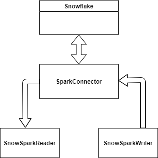

# snowflake-spark
An example of how to connect snowflake with spark

Class Dependencies:

# Executing the job
1. Fill up the config.properties in resources with required parameters.
2. spark-submit --master yarn --deploy-mode cluster --files config.properties --class com.example.Main snowflake-spark-1.0-SNAPSHOT-jar-with-dependencies.jar false config.properties
